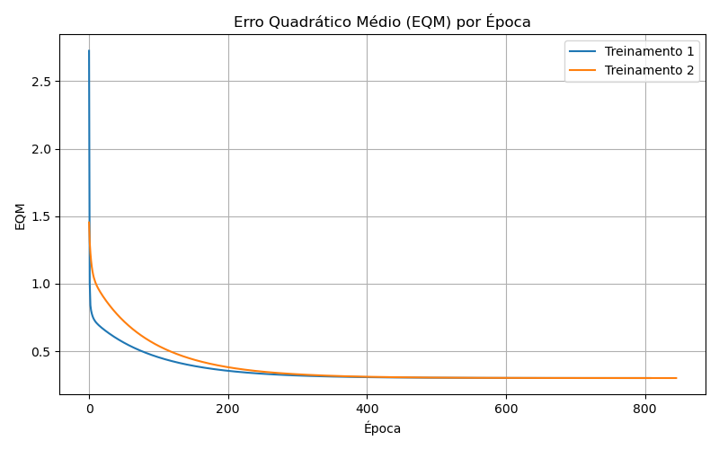

# Resultados da Rede ADALINE para Ajuste de Válvulas

Este documento apresenta os resultados dos 5 treinamentos da rede ADALINE, os gráficos de Erro Quadrático Médio (EQM) e as classificações do conjunto de testes.

## 1. Resultados dos 5 Treinamentos

| Treinamento | Pesos Iniciais (w0, w1, w2, w3, w4) | Pesos Finais (w0, w1, w2, w3, w4) | Épocas |
|:---:|:---|:---|:---:|
| T1 | `[0.3745, 0.9507, 0.7320, 0.5987, 0.1560]` | `[-1.8096, 1.3114, 1.6452, -0.4295, -1.1867]` | 808 |
| T2 | `[0.8231, 0.0261, 0.2108, 0.6184, 0.0983]` | `[-1.8095, 1.3114, 1.6451, -0.4296, -1.1867]` | 845 |
| T3 | `[0.0338, 0.4891, 0.8461, 0.4114, 0.6314]` | `[-1.8096, 1.3114, 1.6451, -0.4297, -1.1867]` | 794 |
| T4 | `[0.1067, 0.6843, 0.5350, 0.3692, 0.4126]` | `[-1.8095, 1.3114, 1.6451, -0.4296, -1.1866]` | 798 |
| T5 | `[0.2752, 0.6392, 0.6239, 0.7780, 0.4781]` | `[-1.8096, 1.3114, 1.6452, -0.4296, -1.1867]` | 820 |

*Nota: `w0` corresponde ao peso do bias (entrada fixa igual a -1).* 

## 2. Gráfico do Erro Quadrático Médio (EQM)

Abaixo está o gráfico comparativo do EQM por época para os dois primeiros treinamentos.

## 3. Classificação das Amostras de Teste

| Amostra | x1 | x2 | x3 | x4 | y (T1) | y (T2) | y (T3) | y (T4) | y (T5) | Válvula Sugerida |
|:---:|:---:|:---:|:---:|:---:|:---:|:---:|:---:|:---:|:---:|:---:|
| 1 | 0.9694 | 0.6909 | 0.4334 | 3.4965 | -1 | -1 | -1 | -1 | -1 | **A** |
| 2 | 0.5427 | 1.3832 | 0.6390 | 4.0352 | -1 | -1 | -1 | -1 | -1 | **A** |
| 3 | 0.6081 | -0.9196 | 0.5925 | 0.1016 | 1 | 1 | 1 | 1 | 1 | **B** |
| 4 | -0.1618 | 0.4694 | 0.2030 | 3.0117 | -1 | -1 | -1 | -1 | -1 | **A** |
| 5 | 0.1870 | -0.2578 | 0.6124 | 1.7749 | -1 | -1 | -1 | -1 | -1 | **A** |
| 6 | 0.4891 | -0.5276 | 0.4378 | 0.6439 | 1 | 1 | 1 | 1 | 1 | **B** |
| 7 | 0.3777 | 2.0149 | 0.7423 | 3.3932 | 1 | 1 | 1 | 1 | 1 | **B** |
| 8 | 1.1498 | -0.4067 | 0.2469 | 1.5866 | 1 | 1 | 1 | 1 | 1 | **B** |
| 9 | 0.9325 | 1.0950 | 1.0359 | 3.3591 | 1 | 1 | 1 | 1 | 1 | **B** |
| 10 | 0.5060 | 1.3317 | 0.9222 | 3.7174 | -1 | -1 | -1 | -1 | -1 | **A** |
| 11 | 0.0497 | -2.0656 | 0.6124 | -0.6585 | -1 | -1 | -1 | -1 | -1 | **A** |
| 12 | 0.4004 | 3.5369 | 0.9766 | 5.3532 | 1 | 1 | 1 | 1 | 1 | **B** |
| 13 | -0.1874 | 1.3343 | 0.5374 | 3.2189 | -1 | -1 | -1 | -1 | -1 | **A** |
| 14 | 0.5060 | 1.3317 | 0.9222 | 3.7174 | -1 | -1 | -1 | -1 | -1 | **A** |
| 15 | 1.6375 | -0.7911 | 0.7537 | 0.5515 | 1 | 1 | 1 | 1 | 1 | **B** |

*Nota: O valor de -1 significa Válvula A, enquanto +1 significa Válvula B.* 

## 4. Análise da Variação de Épocas e Manutenção dos Pesos

**Embora o número de épocas de cada treinamento realizado seja diferente, explique por que então os valores dos pesos continuam praticamente inalterados.**

> A rede ADALINE (*Adaptive Linear Neuron*) utiliza o algoritmo da Regra Delta, cujo objetivo é minimizar o Erro Quadrático Médio (EQM). A superfície de erro para o ADALINE possui a forma de um hiperparaboloide, possuindo um **único mínimo global**.
>
> Como existe apenas um ponto de erro mínimo (as derivadas parciais do erro em relação a cada peso se anulam nesse ponto), o algoritmo do gradiente descendente sempre convergirá para o mesmo vetor de pesos ideais (ou muito próximo a ele, dependendo da precisão $\epsilon$), independentemente de quais foram os pesos iniciais definidos aleatoriamente.
>
> O número de épocas varia porque pesos iniciais diferentes determinam diferentes pontos de partida na superfície de erro, alterando assim a trajetória e a distância (número de passos/épocas) necessária para que o algoritmo consiga descer até o mínimo global.
