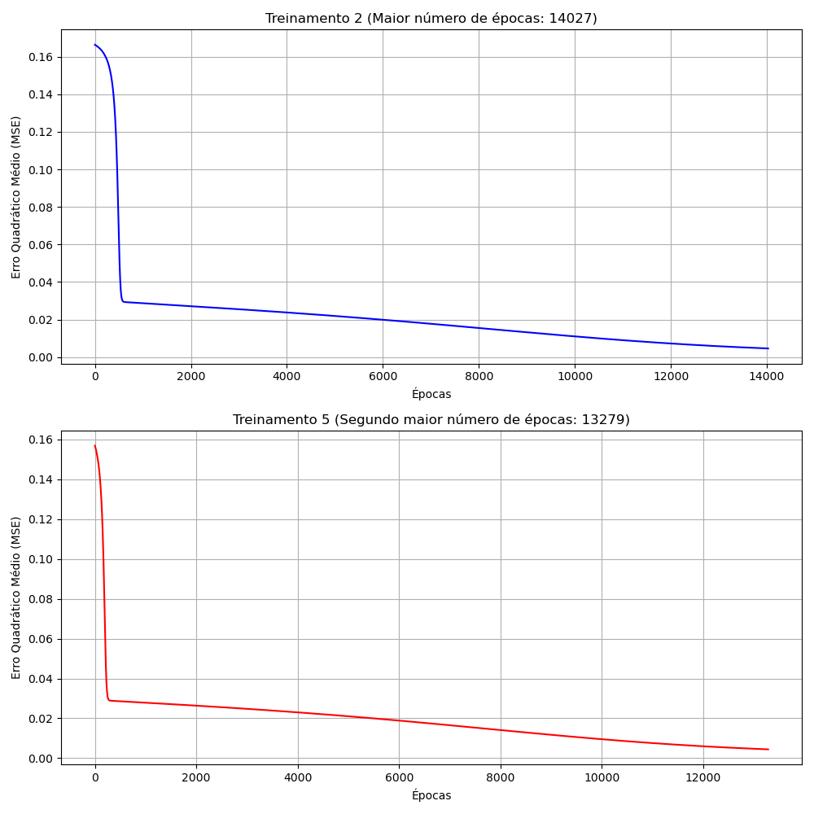

# Relatório do Sistema de Ressonância Magnética (MLP)

Abaixo constam as resoluções das atividades propostas.

---

## Questão 1

**Enunciado:** *Execute 5 treinamentos para a rede PERCEPTRON inicializando as matrizes de pesos em cada treinamento com valores aleatórios entre 0 e 1. Se for o caso, reinicie o gerador de números aleatórios em cada treinamento de tal forma que os elementos das matrizes de pesos iniciais não sejam os mesmos. Utilize a função de ativação logística para todos os neurônios, taxa de aprendizado = 0.1 e precisão = 10-6.*

A rede Perceptron Multicamadas (MLP) foi implementada em Python (NumPy) respeitando estritamente a topologia definida (3 entradas, 10 neurônios na camada oculta e 1 neurônio de saída) e os hiperparâmetros exigidos:
- **Função de ativação:** Logística (Sigmóide) em todas as camadas.
- **Taxa de Aprendizado:** $\alpha = 0.1$
- **Inicialização:** Pesos definidos aleatoriamente no intervalo $[0, 1]$. Foram utilizadas sementes diferentes (`seeds`) no gerador de números aleatórios a cada um dos 5 testes para garantir posições iniciais distintas.
- **Critério de Parada:** Variação do Erro Quadrático Médio estabilizada em $\le 10^{-6}$.

---

## Questão 2

**Enunciado:** *Registre os resultados finais desses 5 treinamentos na tabela abaixo.*

A rede atingiu o critério de convergência nas seguintes épocas, com seus respectivos Erros Quadráticos Médios estáveis:

| Treinamento | Erro Quadrático Médio | Número de Épocas |
| :--- | :--- | :--- |
| 1º (T1) | 0.00426963 | 11257 |
| 2º (T2) | 0.00464107 | 14027 |
| 3º (T3) | 0.00423342 | 13133 |
| 4º (T4) | 0.00439835 | 11299 |
| 5º (T5) | 0.00444427 | 13279 |

---

## Questão 3

**Enunciado:** *Para os dois treinamentos acima com maiores números de épocas, trace os respectivos gráficos dos valores de erro quadrático médio (EQM) em função de cada época de treinamento. Imprima os dois gráficos numa mesma folha de modo não superpostos.*

Os treinamentos mais longos foram o **Treinamento 2** (14.027 épocas) e o **Treinamento 5** (13.279 épocas). Abaixo estão renderizadas as curvas de queda do EQM não superpostas.

---

## Questão 4

**Enunciado:** *Baseado na tabela do item 2, explique de forma detalhada por que tanto o erro quadrático médio quanto o número de épocas variam de treinamento para treinamento.*

A variação no **Erro Quadrático Médio (EQM) final** e no **número de épocas** deve-se exclusivamente à **inicialização aleatória dos pesos sinápticos e dos limiares (*bias*)**, atuando sobre os princípios do *Backpropagation* (Regra Delta):

1. **Superfície de Erro e Ponto de Partida:** Para problemas não lineares e redes com camadas ocultas, a superfície geométrica do Erro Quadrático Médio não é perfeitamente convexa (possui vales e platôs). Como foi exigido que as matrizes de pesos recebessem valores aleatórios novos a cada treinamento, cada uma das 5 execuções iniciou o aprendizado em um "ponto de partida" geométrico completamente diferente do espaço de busca.
2. **Trajetórias de Convergência (Diferença nas Épocas):** Conforme o ponto de partida na superfície de erro, a descida de gradiente tomará diferentes trajetórias. Inicializações que "pousam" a rede próxima a platôs sofrem com gradientes quase nulos, fazendo com que a atualização de pesos seja lenta e a rede demore muito mais épocas para "escorregar" até o fundo do vale (ex: T2 e T5). Inicializações que caem em encostas mais íngremes permitem passos maiores rumo ao mínimo (ex: T1 e T4).
3. **Estagnação em Mínimos Locais (Diferença no EQM):** Ao descer por caminhos independentes, a rede se depara com o critério de convergência $\Delta \le 10^{-6}$ quando a superfície do vale nivela (mínimos locais ou fundo de vales muito longos). A rede interrompe o aprendizado em coordenadas sutilmente diferentes do espaço de erro, resultando num erro estático "congelado" que causa as micro-diferenças ($0.0042$ a $0.0046$) vistas na tabela do item 2.

---

## Questão 5

**Enunciado:** *Para todos os treinamentos efetuados no item 2, faça a validação da rede aplicando o conjunto de teste fornecido na tabela abaixo. Forneça para cada treinamento o erro relativo médio (%) entre os valores desejados e os valores fornecidos pela rede em relação a todos os padrões de teste. Obtenha também a respectiva variância.*

Para validar a rede, os 5 modelos finais foram aplicados aos 20 padrões do conjunto de teste (nunca vistos durante o treinamento). O erro relativo de cada amostra $i$ foi calculado como $E_i = \frac{|d_i - y_{rede\_i}|}{d_i} \times 100\%$. Abaixo estão os valores previstos, o Erro Relativo Médio e a Variância para cada modelo:

| Amostra | x1 | x2 | x3 | d | yrede (T1) | yrede (T2) | yrede (T3) | yrede (T4) | yrede (T5) |
| :--- | :--- | :--- | :--- | :--- | :--- | :--- | :--- | :--- | :--- |
| 1 | 0.0611 | 0.2860 | 0.7464 | 0.4831 | 0.5195 | 0.5247 | 0.5131 | 0.5292 | 0.5252 |
| 2 | 0.5102 | 0.7464 | 0.0860 | 0.5965 | 0.6113 | 0.6186 | 0.6195 | 0.6083 | 0.6096 |
| 3 | 0.0004 | 0.6916 | 0.5006 | 0.5318 | 0.5560 | 0.5675 | 0.5597 | 0.5645 | 0.5559 |
| 4 | 0.9430 | 0.4476 | 0.2648 | 0.6843 | 0.6879 | 0.6809 | 0.6886 | 0.6791 | 0.6883 |
| 5 | 0.1399 | 0.1610 | 0.2477 | 0.2872 | 0.3711 | 0.3778 | 0.3664 | 0.3772 | 0.3716 |
| 6 | 0.6423 | 0.3229 | 0.8567 | 0.7663 | 0.7120 | 0.7046 | 0.7076 | 0.7115 | 0.7107 |
| 7 | 0.6492 | 0.0007 | 0.6422 | 0.5666 | 0.5821 | 0.5732 | 0.5734 | 0.5804 | 0.5884 |
| 8 | 0.1818 | 0.5078 | 0.9046 | 0.6601 | 0.6582 | 0.6580 | 0.6544 | 0.6623 | 0.6580 |
| 9 | 0.7382 | 0.2647 | 0.1916 | 0.5427 | 0.5651 | 0.5631 | 0.5665 | 0.5594 | 0.5709 |
| 10 | 0.3879 | 0.1307 | 0.8656 | 0.5836 | 0.6029 | 0.5981 | 0.5936 | 0.6058 | 0.6075 |
| 11 | 0.1903 | 0.6523 | 0.7820 | 0.6950 | 0.6685 | 0.6697 | 0.6676 | 0.6721 | 0.6666 |
| 12 | 0.8401 | 0.4490 | 0.2719 | 0.6790 | 0.6651 | 0.6600 | 0.6662 | 0.6578 | 0.6659 |
| 13 | 0.0029 | 0.3264 | 0.2476 | 0.2956 | 0.3794 | 0.3902 | 0.3777 | 0.3883 | 0.3782 |
| 14 | 0.7088 | 0.9342 | 0.2763 | 0.7742 | 0.7423 | 0.7419 | 0.7454 | 0.7368 | 0.7372 |
| 15 | 0.1283 | 0.1882 | 0.7253 | 0.4662 | 0.5043 | 0.5078 | 0.4962 | 0.5131 | 0.5109 |
| 16 | 0.8882 | 0.3077 | 0.8931 | 0.8093 | 0.7604 | 0.7514 | 0.7573 | 0.7593 | 0.7579 |
| 17 | 0.2225 | 0.9182 | 0.7820 | 0.7581 | 0.7334 | 0.7332 | 0.7343 | 0.7351 | 0.7274 |
| 18 | 0.1957 | 0.8423 | 0.3085 | 0.5826 | 0.6063 | 0.6163 | 0.6134 | 0.6095 | 0.6029 |
| 19 | 0.9991 | 0.5914 | 0.3933 | 0.7938 | 0.7513 | 0.7449 | 0.7517 | 0.7447 | 0.7497 |
| 20 | 0.2299 | 0.1524 | 0.7353 | 0.5012 | 0.5271 | 0.5282 | 0.5188 | 0.5338 | 0.5340 |
| **Erro Relativo Médio (%)** | - | - | - | - | **6.61%** | **7.31%** | **6.34%** | **7.29%** | **7.02%** |
| **Variância (%)** | - | - | - | - | **58.69** | **72.55** | **54.31** | **70.53** | **57.47** |

---

## Questão 6

**Enunciado:** *Baseado nas análises da tabela acima indique qual das configurações finais de treinamento {T1, T2, T3, T4 ou T5} seria a mais adequada para o sistema de ressonância magnética, ou seja, qual delas está oferecendo a melhor generalização.*

A configuração final mais adequada é o **Treinamento 3 (T3)**.

**Justificativa:** 
O Treinamento 3 apresentou a **melhor capacidade de generalização** ao ser confrontado com dados novos (conjunto de validação/teste). Isso é comprovado pelos seguintes indicadores:
1. **Menor Erro Relativo Médio (6.34%):** De forma global, a rede do T3 previu valores de absorção de energia mais próximos da medição real desejada do que as demais redes, errando menos na média em todos os padrões de teste.
2. **Menor Variância (54.31):** O T3 também gerou os erros com a menor dispersão entre todas as execuções. Isso significa que as previsões da rede são muito mais consistentes. Em termos práticos de um sistema de ressonância, a baixa variância garante que a rede não cometerá erros muito drásticos e absurdos em determinadas amostras (o que seria desastroso num exame), apresentando uma margem de falha previsível, uniforme e controlada sobre os dados novos.
