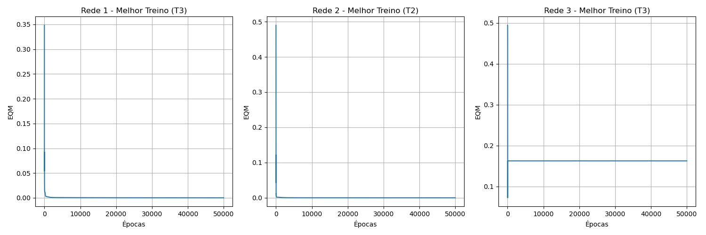
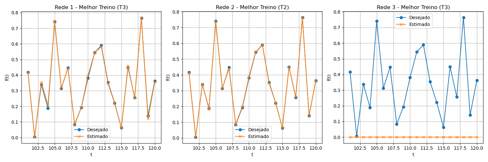

# Resolução do Problema - Perceptron Multicamadas (PMC) Time Delay (TDNN)

## 1 e 2. Resultados dos Treinamentos

| Treinamento | Rede 1 (EQM) | Rede 1 (Épocas) | Rede 2 (EQM) | Rede 2 (Épocas) | Rede 3 (EQM) | Rede 3 (Épocas) |
|---|---|---|---|---|---|---|
| 1º (T1) | 0.15855630 | 50000 | 0.00001558 | 50000 | 0.16230631 | 50000 |
| 2º (T2) | 0.00010901 | 50000 | 0.00001408 | 50000 | 0.16230631 | 50000 |
| 3º (T3) | 0.00007794 | 50000 | 0.16359889 | 50000 | 0.16230563 | 50000 |

## 3. Validação da Rede

| Amostra | f(t) | Rede 1 (T1) | Rede 1 (T2) | Rede 1 (T3) | Rede 2 (T1) | Rede 2 (T2) | Rede 2 (T3) | Rede 3 (T1) | Rede 3 (T2) | Rede 3 (T3) |
|---|---|---|---|---|---|---|---|---|---|---|
| t = 101 | 0.4173 | 0.0000 | 0.4295 | 0.4186 | 0.4145 | 0.4126 | 0.0000 | 0.0000 | 0.0000 | 0.0000 |
| t = 102 | 0.0062 | 0.0000 | 0.0003 | 0.0028 | 0.0032 | 0.0050 | 0.0000 | 0.0000 | 0.0000 | 0.0000 |
| t = 103 | 0.3387 | 0.0000 | 0.3555 | 0.3546 | 0.3427 | 0.3419 | 0.0000 | 0.0000 | 0.0000 | 0.0000 |
| t = 104 | 0.1886 | 0.0000 | 0.2134 | 0.2091 | 0.1875 | 0.1820 | 0.0000 | 0.0000 | 0.0000 | 0.0000 |
| t = 105 | 0.7418 | 0.0000 | 0.7283 | 0.7459 | 0.7374 | 0.7394 | 0.0000 | 0.0000 | 0.0000 | 0.0000 |
| t = 106 | 0.3138 | 0.0000 | 0.3254 | 0.3176 | 0.3169 | 0.3152 | 0.0000 | 0.0000 | 0.0000 | 0.0000 |
| t = 107 | 0.4466 | 0.0000 | 0.4490 | 0.4437 | 0.4354 | 0.4391 | 0.0000 | 0.0000 | 0.0000 | 0.0000 |
| t = 108 | 0.0835 | 0.0000 | 0.0839 | 0.0872 | 0.0908 | 0.0879 | 0.0000 | 0.0000 | 0.0000 | 0.0000 |
| t = 109 | 0.1930 | 0.0000 | 0.1949 | 0.1940 | 0.1938 | 0.1987 | 0.0000 | 0.0000 | 0.0000 | 0.0000 |
| t = 110 | 0.3807 | 0.0000 | 0.4021 | 0.3970 | 0.3990 | 0.3892 | 0.0000 | 0.0000 | 0.0000 | 0.0000 |
| t = 111 | 0.5438 | 0.0000 | 0.5383 | 0.5433 | 0.5460 | 0.5465 | 0.0000 | 0.0000 | 0.0000 | 0.0000 |
| t = 112 | 0.5897 | 0.0000 | 0.5970 | 0.5818 | 0.5904 | 0.5904 | 0.0000 | 0.0000 | 0.0000 | 0.0000 |
| t = 113 | 0.3536 | 0.0000 | 0.3653 | 0.3461 | 0.3481 | 0.3479 | 0.0000 | 0.0000 | 0.0000 | 0.0000 |
| t = 114 | 0.2210 | 0.0000 | 0.2197 | 0.2177 | 0.2225 | 0.2194 | 0.0000 | 0.0000 | 0.0000 | 0.0000 |
| t = 115 | 0.0631 | 0.0000 | 0.0739 | 0.0607 | 0.0639 | 0.0647 | 0.0000 | 0.0000 | 0.0000 | 0.0000 |
| t = 116 | 0.4499 | 0.0000 | 0.4600 | 0.4604 | 0.4520 | 0.4499 | 0.0000 | 0.0000 | 0.0000 | 0.0000 |
| t = 117 | 0.2564 | 0.0000 | 0.2554 | 0.2542 | 0.2592 | 0.2598 | 0.0000 | 0.0000 | 0.0000 | 0.0000 |
| t = 118 | 0.7642 | 0.0000 | 0.7653 | 0.7691 | 0.7636 | 0.7641 | 0.0000 | 0.0000 | 0.0000 | 0.0000 |
| t = 119 | 0.1411 | 0.0000 | 0.1277 | 0.1216 | 0.1415 | 0.1433 | 0.0000 | 0.0000 | 0.0000 | 0.0000 |
| t = 120 | 0.3626 | 0.0000 | 0.3704 | 0.3550 | 0.3641 | 0.3642 | 0.0000 | 0.0000 | 0.0000 | 0.0000 |
| Erro Relativo Médio | - | 1.0000 | 0.0838 | 0.0554 | 0.0375 | 0.0233 | 1.0000 | 1.0000 | 1.0000 | 1.0000 |
| Variância | - | 0.000000 | 0.042078 | 0.013939 | 0.010785 | 0.001685 | 0.000000 | 0.000000 | 0.000000 | 0.000000 |

## 4. Gráficos de Erro Quadrático Médio (EQM) x Épocas

## 5. Gráficos de Valores Desejados x Estimados (t=101..120)

## 6. Análise da Melhor Topologia

Baseado nas análises, a topologia candidata mais adequada para realização de previsões neste processo foi a **Rede 2** com a configuração de treinamento **T2**, que apresentou o menor Erro Relativo Médio de **0.0233** na validação (t=101..120). A complexidade da rede permitiu mapear os padrões do histórico da série temporal adequadamente sem um sobreajuste (overfitting) tão prejudicial quanto o que pode ocorrer em redes maiores ou com generalização muito pobre em redes menores.

## 7. Algoritmos Variantes do Backpropagation

### Algoritmo Resilient-Propagation (RProp)
O **RProp (Resilient Backpropagation)** é uma variação heurística do Backpropagation cujo objetivo primário é eliminar as influências prejudiciais do tamanho das derivadas parciais. Em vez de usar a magnitude do gradiente para atualizar os pesos, o RProp usa apenas o *sinal* (direção) do gradiente. O tamanho da atualização (passo) para cada peso é determinado e adaptado de forma independente: se o gradiente mantém o mesmo sinal entre duas épocas, o tamanho do passo aumenta; se o sinal inverte (indicando que passou do mínimo), o tamanho do passo diminui. 
**Vantagens:** Convergência tipicamente muito mais rápida e estável em relação ao Backpropagation clássico. Além disso, é robusto na escolha de parâmetros (não requer a especificação de uma taxa de aprendizado global `\eta`, pois cada peso tem seu passo adaptativo) e lida bem com problemas de gradientes rasos (flat spots) característicos da função sigmoide.

### Algoritmo Levenberg-Marquardt (LM)
O **Levenberg-Marquardt (LM)** é um algoritmo de otimização projetado para minimizar funções não-lineares, aproximando-se do método de Newton, projetado para velocidade de convergência de segunda ordem sem a necessidade de computar a matriz Hessiana diretamente (usa uma aproximação pela matriz Jacobiana). Ele age como um híbrido entre o método de Gauss-Newton e o de gradiente descendente. Quando a solução está longe do mínimo, age como gradiente descendente; quando está próxima, age como Gauss-Newton.
**Vantagens:** É considerado um dos algoritmos de treinamento mais rápidos para redes neurais de pequeno a médio porte em termos de número de épocas. Produz níveis muito baixos do Erro Quadrático Médio. A grande desvantagem é o alto custo computacional e uso de memória (O(N^2) ou O(N^3) dependendo da implementação) por necessitar da construção e inversão de matrizes Jacobinas em cada época.
